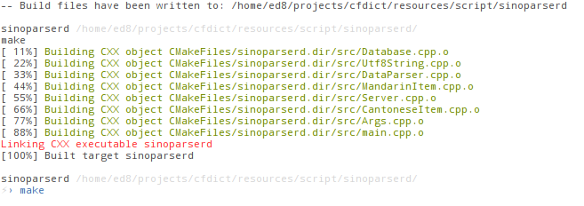

sinoparserd
===========

A service to convert chinese languages (mandarin. cantonese. shanghainese..) into their transliterated form. to segment them etc.

The license only apply to the source code
The data files are provided only as example


### Requirement ###

  * libexpat
  * libevent

### Install ###

If you never used `cmake` have a look at [this tutorial](http://web.cs.swarthmore.edu/~adanner/tips/cmake.php).
```bash
git clone git://github.com/allan-simon/sinoparserd
sudo apt-get install libexpat1{,-dev} libevent-{2.0-5,dev} cmake
cd sinoparserd/ && cmake ./ && make
```
This should output something like:
  > 

### Usage ###

    ./sinoparserd -c  doc/cantonese.xml -m doc/mandarin.xml -p PORT

That will launch an HTTP server listening on port `PORT`. If the option `-p` is missing it will listen on port `8080`

it provides the following API call, that will return a XML answer

  * [/pinyin?str=\*](http://localhost:8080/pinyin?str=\*)
  * [/jyutping?str=\*](http://localhost:8080/jyutping?str=\*)
  * [/change\_script?str=\*](http://localhost:8080/change\_script?str=\*)
  * [/trad?str=\*](http://localhost:8080/trad?str=\*)
  * [/simp?str=\*](http://localhost:8080/simp?str=\*)
  * [\_script?str=\*](http://localhost:8080/guess\_script?str=\*)
  * [/all?str=\*](http://localhost:8080/all?str=\*)

### Updating Data Files ###

To regenerate `doc/mandarin.xml` with an updated version of CC-CEDICT, run
```bash
python tools/mandarin > doc/mandarin.xml
```

If any new ambiguous entries have been added to CC-CEDICT, this will fail. In
that case, add the entries in question to `tools/mandarin/preference.py` to
specify which variant should be used.

### Evaluating Transcriptions ###

To evaluate changes to the transcription engine, `tools/batch_transcribe.py` and
`tools/diff` can be used as follows:

1. Get the list of Mandarin sentences from Tatoeba:
```bash
wget 'https://downloads.tatoeba.org/exports/per_language/cmn/cmn_sentences.tsv.bz2'
bunzip2 cmn_sentences.tsv.bz2
```
2. Run `sinoparserd` with the old configuration
```bash
sinoparserd -m old_mandarin.xml
```
3. Transcribe all sentences
```bash
cat cmn_sentences.tsv | tools/batch_transcribe.py > old_cmn_transcriptions.tsv
```
4. Run `sinoparserd` with the new configuration and repeat.
5. Generate a report of the differences
```bash
python tools/diff/ {old,new}_cmn_transcriptions.tsv > report.html
```
6. View the generated HTML in a browser.
7. To compare against manually edited transcriptions, download them from Tatoeba
```bash
wget 'https://downloads.tatoeba.org/exports/transcriptions.tar.bz2'
tar xf transcriptions.tar.bz2
```
8. And include them in the comparison
```bash
python tools/diff/ {old,new}_cmn_transcriptions.tsv transcriptions.csv > report.html
```

## License

All the source code is licensed under GPLv3, the xml files are under their own license.

The license for `cantonese.xml` (likely sourced from cantodict) is an "open one" but i need to check which one, certainly CC-BY-SA.

The license for `mandarin.xml` (sourced from CC-CEDICT) is CC BY-SA 4.0. See the comment at the beginning of the file for more details.

So for the moment I would recommend people to use their own data files for "public usage" and use the provided xml only for "test" purpose.
